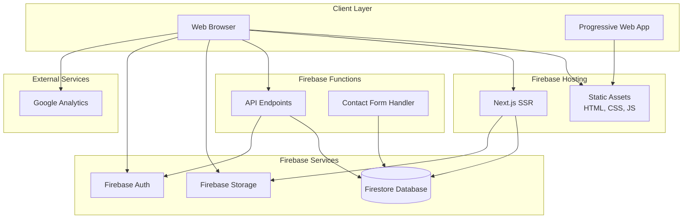

# Design Document: Portfolio Website

## Overview

This document describes the technical design for a modern, dynamic portfolio website built entirely on Firebase's free-tier services. The system consists of a React-based frontend hosted on Firebase Hosting, serverless API endpoints via Firebase Functions, Firestore for data persistence, and Firebase Storage for media files.

The architecture prioritizes:
- **Zero cost operation** within Firebase free-tier limits
- **Performance** with client-side caching and optimized queries
- **SEO** through server-side rendering and meta tag optimization
- **Accessibility** following WCAG 2.1 guidelines
- **Developer experience** with modern tooling and clear separation of concerns

## Architecture

### System Architecture



### Technology Stack

**Frontend:**
- **Framework**: Next.js 14+ (React 18+)
  - Server-side rendering for SEO
  - Static generation for performance
  - Built-in routing and API routes
  - Image optimization
- **Styling**: Tailwind CSS
  - Utility-first CSS framework
  - Built-in dark mode support
  - Responsive design utilities
- **State Management**: React Context API + SWR
  - SWR for data fetching and caching
  - Context for global state (theme, auth)
- **Form Handling**: React Hook Form
  - Performant form validation
  - Minimal re-renders

**Backend:**
- **Firebase Functions**: Node.js 18+ runtime
  - Serverless API endpoints
  - Contact form processing
  - Admin operations
- **Firestore**: NoSQL database
  - Collections: projects, inquiries, profile
  - Real-time updates capability
- **Firebase Storage**: File storage
  - Project images
  - Resume PDF
- **Firebase Authentication**: Admin access
  - Email/password authentication
  - Protected admin routes

**Development Tools:**
- **TypeScript**: Type safety across frontend and backend
- **ESLint + Prettier**: Code quality and formatting
- **Firebase Emulator Suite**: Local development
- **Vercel** (optional): Alternative hosting with Next.js optimization

### Data Flow

**Public User Flow:**
1. User visits website → Firebase Hosting serves Next.js app
2. Next.js SSR fetches initial data from Firestore
3. Client-side navigation uses SWR for cached data
4. Contact form submission → Firebase Function → Firestore
5. Resume download → Direct link to Firebase Storage

**Admin Flow:**
1. Admin logs in → Firebase Auth
2. Admin creates/edits project → Firebase Function validates → Firestore
3. Admin uploads image → Firebase Storage
4. Changes immediately reflected on public site

## Components and Interfaces

### Frontend Components

#### Page Components

**HomePage** (`pages/index.tsx`)
```typescript
interface HomePageProps {
  profile: ProfileData;
  featuredProjects: Project[];
}

// Server-side props for SEO
export async function getStaticProps(): Promise<{ props: HomePageProps }> {
  const profile = await fetchProfile();
  const projects = await fetchFeaturedProjects();
  return { props: { profile, featuredProjects: projects }, revalidate: 3600 };
}
```

**ProjectsPage** (`pages/projects/index.tsx`)
```typescript
interface ProjectsPageProps {
  projects: Project[];
  categories: string[];
}

// Static generation with ISR (Incremental Static Regeneration)
export async function getStaticProps(): Promise<{ props: ProjectsPageProps }> {
  const projects = await fetchAllProjects();
  const categories = extractCategories(projects);
  return { props: { projects, categories }, revalidate: 1800 };
}
```

**ProjectDetailPage** (`pages/projects/[id].tsx`)
```typescript
interface ProjectDetailProps {
  project: Project;
}

export async function getStaticPaths() {
  const projects = await fetchAllProjects();
  return {
    paths: projects.map(p => ({ params: { id: p.id } })),
    fallback: 'blocking'
  };
}

export async function getStaticProps({ params }) {
  const project = await fetchProject(params.id);
  return { props: { project }, revalidate: 1800 };
}
```

**ContactPage** (`pages/contact.tsx`)
```typescript
interface ContactFormData {
  name: string;
  email: string;
  subject: string;
  message: string;
}

// Client-side form handling
function ContactPage() {
  const { register, handleSubmit, formState: { errors } } = useForm<ContactFormData>();
  const onSubmit = async (data: ContactFormData) => {
    await submitInquiry(data);
  };
}
```

**AdminDashboard** (`pages/admin/index.tsx`)
```typescript
// Protected route with authentication check
function AdminDashboard() {
  const { user, loading } = useAuth();
  
  if (loading) return <LoadingSpinner />;
  if (!user) return <Redirect to="/admin/login" />;
  
  return <AdminLayout>...</AdminLayout>;
}
```

#### UI Components

**ProjectCard** (`components/ProjectCard.tsx`)
```typescript
interface ProjectCardProps {
  project: Project;
  variant?: 'grid' | 'list';
}

function ProjectCard({ project, variant = 'grid' }: ProjectCardProps) {
  return (
    <article className="project-card">
      <Image src={project.thumbnail} alt={project.title} />
      <h3>{project.title}</h3>
      <p>{project.description}</p>
      <TechTags tags={project.technologies} />
    </article>
  );
}
```

**ContactForm** (`components/ContactForm.tsx`)
```typescript
interface ContactFormProps {
  onSuccess?: () => void;
  onError?: (error: Error) => void;
}

function ContactForm({ onSuccess, onError }: ContactFormProps) {
  // Form validation and submission logic
  // Rate limiting check before submission
  // Display success/error messages
}
```

**Navigation** (`components/Navigation.tsx`)
```typescript
interface NavigationProps {
  currentPath: string;
}

function Navigation({ currentPath }: NavigationProps) {
  // Responsive navigation with mobile hamburger menu
  // Active link highlighting
  // Dark mode toggle
  // Social media links
}
```

### Backend API Endpoints

#### Firebase Functions

**getProjects** (`functions/src/api/projects.ts`)
```typescript
// GET /api/v1/projects
export const getProjects = functions.https.onRequest(async (req, res) => {
  // Set CORS headers
  res.set('Access-Control-Allow-Origin', '*');
  
  if (req.method !== 'GET') {
    res.status(405).send('Method Not Allowed');
    return;
  }
  
  try {
    const projectsSnapshot = await db.collection('projects')
      .where('published', '==', true)
      .orderBy('createdAt', 'desc')
      .get();
    
    const projects = projectsSnapshot.docs.map(doc => ({
      id: doc.id,
      ...doc.data()
    }));
    
    res.status(200).json({ projects });
  } catch (error) {
    res.status(500).json({ error: 'Failed to fetch projects' });
  }
});
```

**getProjectById** (`functions/src/api/projects.ts`)
```typescript
// GET /api/v1/projects/:id
export const getProjectById = functions.https.onRequest(async (req, res) => {
  const projectId = req.path.split('/').pop();
  
  try {
    const projectDoc = await db.collection('projects').doc(projectId).get();
    
    if (!projectDoc.exists) {
      res.status(404).json({ error: 'Project not found' });
      return;
    }
    
    res.status(200).json({ project: { id: projectDoc.id, ...projectDoc.data() } });
  } catch (error) {
    res.status(500).json({ error: 'Failed to fetch project' });
  }
});
```

**submitInquiry** (`functions/src/api/contact.ts`)
```typescript
// POST /api/v1/contact
export const submitInquiry = functions.https.onRequest(async (req, res) => {
  if (req.method !== 'POST') {
    res.status(405).send('Method Not Allowed');
    return;
  }
  
  const { name, email, subject, message } = req.body;
  
  // Validation
  if (!name || !email || !subject || !message) {
    res.status(400).json({ error: 'All fields are required' });
    return;
  }
  
  if (!isValidEmail(email)) {
    res.status(400).json({ error: 'Invalid email address' });
    return;
  }
  
  // Rate limiting check
  const clientIP = req.ip;
  const recentSubmissions = await checkRateLimit(clientIP);
  if (recentSubmissions >= 3) {
    res.status(429).json({ error: 'Too many submissions. Please try again later.' });
    return;
  }
  
  try {
    await db.collection('inquiries').add({
      name,
      email,
      subject,
      message,
      timestamp: admin.firestore.FieldValue.serverTimestamp(),
      ip: clientIP,
      read: false
    });
    
    res.status(200).json({ success: true, message: 'Inquiry submitted successfully' });
  } catch (error) {
    res.status(500).json({ error: 'Failed to submit inquiry' });
  }
});
```

**getProfile** (`functions/src/api/profile.ts`)
```typescript
// GET /api/v1/profile
export const getProfile = functions.https.onRequest(async (req, res) => {
  try {
    const profileDoc = await db.collection('profile').doc('main').get();
    
    if (!profileDoc.exists) {
      res.status(404).json({ error: 'Profile not found' });
      return;
    }
    
    res.status(200).json({ profile: profileDoc.data() });
  } catch (error) {
    res.status(500).json({ error: 'Failed to fetch profile' });
  }
});
```

**Admin Functions** (`functions/src/api/admin.ts`)
```typescript
// POST /api/v1/admin/projects (Create)
// PUT /api/v1/admin/projects/:id (Update)
// DELETE /api/v1/admin/projects/:id (Delete)

export const createProject = functions.https.onRequest(async (req, res) => {
  // Verify Firebase Auth token
  const token = req.headers.authorization?.split('Bearer ')[1];
  if (!token) {
    res.status(401).json({ error: 'Unauthorized' });
    return;
  }
  
  try {
    const decodedToken = await admin.auth().verifyIdToken(token);
    // Only proceed if authenticated
    
    const projectData = req.body;
    const docRef = await db.collection('projects').add({
      ...projectData,
      createdAt: admin.firestore.FieldValue.serverTimestamp(),
      updatedAt: admin.firestore.FieldValue.serverTimestamp()
    });
    
    res.status(201).json({ id: docRef.id, message: 'Project created' });
  } catch (error) {
    res.status(500).json({ error: 'Failed to create project' });
  }
});
```

### Helper Functions

**Rate Limiting** (`functions/src/utils/rateLimit.ts`)
```typescript
async function checkRateLimit(ip: string): Promise<number> {
  const oneHourAgo = new Date(Date.now() - 60 * 60 * 1000);
  
  const recentSubmissions = await db.collection('inquiries')
    .where('ip', '==', ip)
    .where('timestamp', '>', oneHourAgo)
    .get();
  
  return recentSubmissions.size;
}
```

**Email Validation** (`functions/src/utils/validation.ts`)
```typescript
function isValidEmail(email: string): boolean {
  const emailRegex = /^[^\s@]+@[^\s@]+\.[^\s@]+$/;
  return emailRegex.test(email);
}
```

**Caching Utilities** (`lib/cache.ts`)
```typescript
// SWR configuration for client-side caching
export const swrConfig = {
  revalidateOnFocus: false,
  revalidateOnReconnect: true,
  dedupingInterval: 60000, // 1 minute
  focusThrottleInterval: 300000 // 5 minutes
};

// Cache projects in memory for 30 minutes
export function useCachedProjects() {
  return useSWR('/api/v1/projects', fetcher, {
    ...swrConfig,
    refreshInterval: 1800000 // 30 minutes
  });
}
```

## Data Models

### Firestore Collections

#### Projects Collection (`projects`)

```typescript
interface Project {
  id: string;                    // Document ID
  title: string;                 // Project title
  description: string;           // Short description (150-200 chars)
  fullDescription: string;       // Detailed description (markdown supported)
  thumbnail: string;             // Firebase Storage URL
  images: string[];              // Array of Firebase Storage URLs
  technologies: string[];        // Array of technology tags
  category: string;              // Project category
  liveUrl?: string;              // Optional live demo URL
  githubUrl?: string;            // Optional GitHub repository URL
  featured: boolean;             // Show on homepage
  published: boolean;            // Visibility status
  order: number;                 // Display order
  createdAt: Timestamp;          // Creation timestamp
  updatedAt: Timestamp;          // Last update timestamp
}
```

**Firestore Security Rules:**
```javascript
match /projects/{projectId} {
  // Anyone can read published projects
  allow read: if resource.data.published == true;
  
  // Only authenticated users can write
  allow create, update, delete: if request.auth != null;
}
```

#### Inquiries Collection (`inquiries`)

```typescript
interface Inquiry {
  id: string;                    // Document ID
  name: string;                  // Sender name
  email: string;                 // Sender email
  subject: string;               // Inquiry subject
  message: string;               // Inquiry message
  timestamp: Timestamp;          // Submission timestamp
  ip: string;                    // Client IP (for rate limiting)
  read: boolean;                 // Admin read status
  replied: boolean;              // Admin replied status
}
```

**Firestore Security Rules:**
```javascript
match /inquiries/{inquiryId} {
  // No public read access
  allow read: if request.auth != null;
  
  // Anyone can create (handled by function with rate limiting)
  allow create: if true;
  
  // Only authenticated users can update/delete
  allow update, delete: if request.auth != null;
}
```

#### Profile Collection (`profile`)

```typescript
interface Profile {
  name: string;                  // Full name
  title: string;                 // Professional title
  bio: string;                   // Short biography
  email: string;                 // Contact email
  linkedin: string;              // LinkedIn profile URL
  github?: string;               // Optional GitHub profile URL
  twitter?: string;              // Optional Twitter profile URL
  resumeUrl: string;             // Firebase Storage URL for resume PDF
  avatar: string;                // Firebase Storage URL for profile image
  skills: string[];              // Array of skills
  updatedAt: Timestamp;          // Last update timestamp
}
```

**Firestore Security Rules:**
```javascript
match /profile/main {
  // Anyone can read profile
  allow read: if true;
  
  // Only authenticated users can write
  allow write: if request.auth != null;
}
```

### Firebase Storage Structure

```
storage/
├── projects/
│   ├── {projectId}/
│   │   ├── thumbnail.webp
│   │   ├── image-1.webp
│   │   ├── image-2.webp
│   │   └── ...
├── profile/
│   ├── avatar.webp
│   └── resume.pdf
└── temp/
    └── {uploadId}/
```

**Storage Security Rules:**
```javascript
service firebase.storage {
  match /b/{bucket}/o {
    // Public read access for projects and profile
    match /projects/{allPaths=**} {
      allow read: if true;
      allow write: if request.auth != null;
    }
    
    match /profile/{allPaths=**} {
      allow read: if true;
      allow write: if request.auth != null;
    }
    
    // Temp folder for uploads (auto-cleanup after 24h)
    match /temp/{allPaths=**} {
      allow read, write: if request.auth != null;
    }
  }
}
```

### TypeScript Type Definitions

**Shared Types** (`types/index.ts`)
```typescript
export interface Project {
  id: string;
  title: string;
  description: string;
  fullDescription: string;
  thumbnail: string;
  images: string[];
  technologies: string[];
  category: string;
  liveUrl?: string;
  githubUrl?: string;
  featured: boolean;
  published: boolean;
  order: number;
  createdAt: Date;
  updatedAt: Date;
}

export interface Inquiry {
  id: string;
  name: string;
  email: string;
  subject: string;
  message: string;
  timestamp: Date;
  ip: string;
  read: boolean;
  replied: boolean;
}

export interface Profile {
  name: string;
  title: string;
  bio: string;
  email: string;
  linkedin: string;
  github?: string;
  twitter?: string;
  resumeUrl: string;
  avatar: string;
  skills: string[];
  updatedAt: Date;
}

export interface ContactFormData {
  name: string;
  email: string;
  subject: string;
  message: string;
}

export interface APIResponse<T> {
  data?: T;
  error?: string;
  message?: string;
}
```

## Correctness Properties

*A property is a characteristic or behavior that should hold true across all valid executions of a system—essentially, a formal statement about what the system should do. Properties serve as the bridge between human-readable specifications and machine-verifiable correctness guarantees.*


### Property 1: Profile Data Completeness
*For any* landing page render, the output SHALL contain the Portfolio_Owner's name, professional title, and brief introduction as non-empty values.
**Validates: Requirements 1.2**

### Property 2: Navigation Completeness
*For any* page render, the navigation component SHALL include links to all major sections (Projects, Contact, Resume).
**Validates: Requirements 1.3**

### Property 3: Social Links Presence
*For any* page render, the output SHALL display social media links for Email and LinkedIn.
**Validates: Requirements 1.5, 5.1**

### Property 4: Published Projects Visibility
*For any* set of projects where some have published=true and others have published=false, querying all projects SHALL return only those with published=true.
**Validates: Requirements 2.1**

### Property 5: Project Data Completeness
*For any* project render (list or detail view), the output SHALL contain title, description, thumbnail, and technology tags as non-empty values.
**Validates: Requirements 2.2, 2.3**

### Property 6: Project Organization
*For any* list of projects, the rendered output SHALL group or sort projects by their category field.
**Validates: Requirements 2.4**

### Property 7: Resume File Format
*For any* resume download request, the served file SHALL have MIME type "application/pdf".
**Validates: Requirements 3.2**

### Property 8: Resume Filename Format
*For any* profile with a name field, the resume download filename SHALL include that name.
**Validates: Requirements 3.3**

### Property 9: Download Event Tracking
*For any* resume download action, an analytics event SHALL be logged with event type "resume_download".
**Validates: Requirements 3.5**

### Property 10: Valid Inquiry Persistence
*For any* valid inquiry submission (all required fields present, valid email format), the inquiry SHALL be stored in Firestore with all submitted fields plus a timestamp.
**Validates: Requirements 4.2, 4.8**

### Property 11: Invalid Field Validation
*For any* form submission with one or more invalid fields, the system SHALL return validation error messages identifying each invalid field.
**Validates: Requirements 4.3**

### Property 12: Successful Submission Feedback
*For any* successful inquiry submission, the system SHALL return a success message and the form state SHALL be cleared.
**Validates: Requirements 4.5**

### Property 13: Email Format Validation
*For any* string input to the email field, the validation function SHALL correctly identify whether it matches standard email format (contains @ and domain).
**Validates: Requirements 4.6**

### Property 14: Rate Limiting Enforcement
*For any* IP address, if 3 inquiry submissions have been made within the past hour, a 4th submission attempt SHALL be rejected with a 429 status code.
**Validates: Requirements 4.7**

### Property 15: Optional Social Links Display
*For any* profile configuration with additional social platform URLs (beyond Email and LinkedIn), all configured social links SHALL be rendered.
**Validates: Requirements 5.4**

### Property 16: Project Retrieval by ID
*For any* valid project ID in the database, calling GET /api/projects/:id SHALL return that project's complete data.
**Validates: Requirements 6.2**

### Property 17: JSON Response Format
*For any* API endpoint request, the response SHALL be valid JSON (parseable without errors).
**Validates: Requirements 6.4**

### Property 18: Not Found Error Handling
*For any* API request for a non-existent resource ID, the response SHALL have status code 404 and include an error message.
**Validates: Requirements 6.5**

### Property 19: CORS Headers Presence
*For any* API response, the headers SHALL include Access-Control-Allow-Origin.
**Validates: Requirements 6.6**

### Property 20: API Versioning
*For any* API endpoint URL, the path SHALL include a version prefix (e.g., /api/v1/).
**Validates: Requirements 6.7**

### Property 21: Image Format Optimization
*For any* project image served, the image SHALL be in WebP format or include a WebP alternative.
**Validates: Requirements 7.3**

### Property 22: Cache Headers for Static Assets
*For any* static asset response (CSS, JS, images), the response headers SHALL include cache-control directives.
**Validates: Requirements 7.5**

### Property 23: Unique Page Meta Tags
*For any* two different pages, their meta title and description tags SHALL have different values.
**Validates: Requirements 8.1, 8.7**

### Property 24: Open Graph Tags Presence
*For any* page render, the HTML SHALL include Open Graph meta tags (og:title, og:description, og:image).
**Validates: Requirements 8.2, 14.6**

### Property 25: Sitemap Completeness
*For any* set of public pages, the generated sitemap.xml SHALL contain URL entries for all of them.
**Validates: Requirements 8.3**

### Property 26: Structured Data Markup
*For any* project detail page, the HTML SHALL include JSON-LD structured data markup.
**Validates: Requirements 8.4**

### Property 27: Canonical URL Presence
*For any* page render, the HTML SHALL include a canonical link tag.
**Validates: Requirements 8.6**

### Property 28: Analytics Event Tracking
*For any* tracked action (page view, resume download, project view, inquiry submission), an analytics event SHALL be sent with the appropriate event type.
**Validates: Requirements 10.2, 10.3**

### Property 29: Do Not Track Respect
*For any* request where the DNT header is set to "1", analytics tracking SHALL be disabled.
**Validates: Requirements 10.5**

### Property 30: Image Upload Acceptance
*For any* valid image file (JPEG, PNG, WebP) under 5MB, the upload function SHALL accept and store it in Firebase Storage.
**Validates: Requirements 11.3**

### Property 31: Admin Authentication Protection
*For any* request to an admin endpoint without a valid authentication token, the response SHALL have status code 401.
**Validates: Requirements 11.4**

### Property 32: Draft Visibility Control
*For any* project with published=false, it SHALL NOT appear in public project queries.
**Validates: Requirements 11.5**

### Property 33: Publish Visibility Effect
*For any* project, when its published field changes from false to true, it SHALL immediately appear in public project queries.
**Validates: Requirements 11.6**

### Property 34: API Error Message Display
*For any* failed API request, the UI SHALL display an error message to the user.
**Validates: Requirements 12.2**

### Property 35: Form Error State Preservation
*For any* form submission that fails validation, the form SHALL retain all user-entered values.
**Validates: Requirements 12.3**

### Property 36: Server Error Logging
*For any* server error (5xx status), the error details SHALL be logged and a generic error message SHALL be returned to the client.
**Validates: Requirements 12.5**

### Property 37: Heading Hierarchy Validity
*For any* page HTML, heading tags SHALL follow proper hierarchy (h1 before h2, h2 before h3, etc.) without skipping levels.
**Validates: Requirements 13.1**

### Property 38: Image Alt Text Presence
*For any* img element in the rendered HTML, an alt attribute SHALL be present.
**Validates: Requirements 13.2**

### Property 39: ARIA Labels for Interactive Components
*For any* complex interactive component (modals, dropdowns, custom controls), ARIA labels or descriptions SHALL be present.
**Validates: Requirements 13.5**

### Property 40: Theme Preference Persistence
*For any* dark mode toggle action, the preference SHALL be saved to localStorage and restored on subsequent page loads.
**Validates: Requirements 14.3**

### Property 41: Search Result Relevance
*For any* search query, all returned projects SHALL contain the search term in their title, description, or technology tags.
**Validates: Requirements 14.5**

### Property 42: Firestore Security Rules Enforcement
*For any* unauthenticated request attempting to write to Firestore, the request SHALL be denied by security rules.
**Validates: Requirements 15.6**

### Property 43: Client-Side Cache Effectiveness
*For any* data request that has been made previously within the cache TTL, the second request SHALL use cached data without querying Firestore.
**Validates: Requirements 15.10, 15.11**

## Error Handling

### Error Categories

**Client Errors (4xx)**
- **400 Bad Request**: Invalid input data, validation failures
- **401 Unauthorized**: Missing or invalid authentication token
- **404 Not Found**: Resource does not exist
- **429 Too Many Requests**: Rate limit exceeded

**Server Errors (5xx)**
- **500 Internal Server Error**: Unexpected server-side errors
- **503 Service Unavailable**: Firebase service temporarily unavailable

### Error Response Format

All API errors follow a consistent JSON structure:

```typescript
interface ErrorResponse {
  error: string;           // Human-readable error message
  code: string;            // Machine-readable error code
  details?: any;           // Optional additional error details
  timestamp: string;       // ISO 8601 timestamp
}
```

Example:
```json
{
  "error": "Invalid email address format",
  "code": "VALIDATION_ERROR",
  "details": {
    "field": "email",
    "value": "invalid-email"
  },
  "timestamp": "2024-01-15T10:30:00Z"
}
```

### Error Handling Strategies

**Frontend Error Handling:**
```typescript
// API call wrapper with error handling
async function apiCall<T>(endpoint: string, options?: RequestInit): Promise<T> {
  try {
    const response = await fetch(endpoint, options);
    
    if (!response.ok) {
      const errorData = await response.json();
      throw new APIError(errorData.error, response.status, errorData.code);
    }
    
    return await response.json();
  } catch (error) {
    if (error instanceof APIError) {
      // Display user-friendly error message
      showErrorToast(error.message);
      throw error;
    }
    
    // Network or unexpected errors
    showErrorToast('An unexpected error occurred. Please try again.');
    logError(error);
    throw error;
  }
}
```

**Backend Error Handling:**
```typescript
// Firebase Function error handler
function handleError(error: any, res: Response) {
  console.error('Error:', error);
  
  if (error instanceof ValidationError) {
    res.status(400).json({
      error: error.message,
      code: 'VALIDATION_ERROR',
      details: error.details,
      timestamp: new Date().toISOString()
    });
    return;
  }
  
  if (error instanceof AuthError) {
    res.status(401).json({
      error: 'Authentication required',
      code: 'AUTH_ERROR',
      timestamp: new Date().toISOString()
    });
    return;
  }
  
  // Generic server error
  res.status(500).json({
    error: 'An internal error occurred',
    code: 'INTERNAL_ERROR',
    timestamp: new Date().toISOString()
  });
}
```

**Firestore Error Handling:**
```typescript
// Graceful Firestore error handling
async function getProjects(): Promise<Project[]> {
  try {
    const snapshot = await db.collection('projects')
      .where('published', '==', true)
      .get();
    
    return snapshot.docs.map(doc => ({ id: doc.id, ...doc.data() } as Project));
  } catch (error) {
    if (error.code === 'permission-denied') {
      throw new AuthError('Access denied');
    }
    
    if (error.code === 'unavailable') {
      throw new ServiceError('Database temporarily unavailable');
    }
    
    throw new Error('Failed to fetch projects');
  }
}
```

### User-Facing Error Messages

**Form Validation Errors:**
- "Please enter your name"
- "Please enter a valid email address"
- "Message must be at least 10 characters"
- "Please complete all required fields"

**API Errors:**
- "Failed to load projects. Please refresh the page."
- "Failed to submit inquiry. Please try again."
- "You've reached the submission limit. Please try again later."
- "Session expired. Please log in again."

**Network Errors:**
- "No internet connection. Please check your network."
- "Request timed out. Please try again."

### Error Logging

**Client-Side Logging:**
```typescript
function logError(error: Error, context?: any) {
  // Log to console in development
  if (process.env.NODE_ENV === 'development') {
    console.error('Error:', error, 'Context:', context);
  }
  
  // Send to analytics in production
  if (process.env.NODE_ENV === 'production') {
    analytics.logEvent('error', {
      message: error.message,
      stack: error.stack,
      context: JSON.stringify(context)
    });
  }
}
```

**Server-Side Logging:**
```typescript
// Firebase Functions automatically log to Cloud Logging
function logServerError(error: Error, request: Request) {
  console.error({
    error: error.message,
    stack: error.stack,
    path: request.path,
    method: request.method,
    ip: request.ip,
    timestamp: new Date().toISOString()
  });
}
```

## Testing Strategy

### Dual Testing Approach

The testing strategy employs both unit tests and property-based tests to ensure comprehensive coverage:

**Unit Tests:**
- Specific examples and edge cases
- Integration points between components
- Error conditions and boundary cases
- UI component rendering
- API endpoint contracts

**Property-Based Tests:**
- Universal properties across all inputs
- Data validation rules
- API response formats
- Security rules enforcement
- Caching behavior

Together, unit tests catch concrete bugs while property tests verify general correctness across a wide range of inputs.

### Testing Tools

**Frontend Testing:**
- **Jest**: Unit test runner
- **React Testing Library**: Component testing
- **fast-check**: Property-based testing library for TypeScript
- **Cypress**: End-to-end testing (optional)

**Backend Testing:**
- **Jest**: Unit test runner for Firebase Functions
- **Firebase Emulator Suite**: Local testing environment
- **fast-check**: Property-based testing for API logic
- **Supertest**: HTTP assertion library

### Property-Based Test Configuration

All property-based tests MUST:
- Run a minimum of 100 iterations per test
- Include a comment tag referencing the design property
- Tag format: `// Feature: portfolio-website, Property {number}: {property_text}`

Example:
```typescript
// Feature: portfolio-website, Property 13: Email Format Validation
test('email validation correctly identifies valid and invalid emails', () => {
  fc.assert(
    fc.property(fc.emailAddress(), (email) => {
      expect(isValidEmail(email)).toBe(true);
    }),
    { numRuns: 100 }
  );
  
  fc.assert(
    fc.property(fc.string(), (str) => {
      fc.pre(!str.includes('@')); // Assume no @ symbol
      expect(isValidEmail(str)).toBe(false);
    }),
    { numRuns: 100 }
  );
});
```

### Test Coverage Requirements

**Minimum Coverage Targets:**
- Unit test coverage: 80% of code
- Property test coverage: All correctness properties from design
- Integration test coverage: All API endpoints
- E2E test coverage: Critical user flows (optional for MVP)

### Testing Phases

**Phase 1: Unit Tests**
- Test individual functions and components
- Mock external dependencies (Firestore, Storage, Auth)
- Fast execution for rapid feedback

**Phase 2: Property-Based Tests**
- Test universal properties with generated inputs
- Verify data validation and transformation logic
- Test API contracts and response formats

**Phase 3: Integration Tests**
- Test with Firebase Emulator Suite
- Verify Firestore security rules
- Test complete API flows

**Phase 4: E2E Tests (Optional)**
- Test critical user journeys
- Verify UI interactions
- Test across different browsers

### Example Test Structure

**Unit Test Example:**
```typescript
describe('ContactForm', () => {
  it('displays validation errors for empty fields', () => {
    render(<ContactForm />);
    
    fireEvent.click(screen.getByRole('button', { name: /submit/i }));
    
    expect(screen.getByText(/please enter your name/i)).toBeInTheDocument();
    expect(screen.getByText(/please enter a valid email/i)).toBeInTheDocument();
  });
  
  it('submits form with valid data', async () => {
    const mockSubmit = jest.fn();
    render(<ContactForm onSubmit={mockSubmit} />);
    
    fireEvent.change(screen.getByLabelText(/name/i), { target: { value: 'John Doe' } });
    fireEvent.change(screen.getByLabelText(/email/i), { target: { value: 'john@example.com' } });
    fireEvent.change(screen.getByLabelText(/subject/i), { target: { value: 'Inquiry' } });
    fireEvent.change(screen.getByLabelText(/message/i), { target: { value: 'Hello world' } });
    
    fireEvent.click(screen.getByRole('button', { name: /submit/i }));
    
    await waitFor(() => {
      expect(mockSubmit).toHaveBeenCalledWith({
        name: 'John Doe',
        email: 'john@example.com',
        subject: 'Inquiry',
        message: 'Hello world'
      });
    });
  });
});
```

**Property-Based Test Example:**
```typescript
// Feature: portfolio-website, Property 10: Valid Inquiry Persistence
describe('Inquiry Submission', () => {
  it('stores all valid inquiries in Firestore', async () => {
    await fc.assert(
      fc.asyncProperty(
        fc.record({
          name: fc.string({ minLength: 1 }),
          email: fc.emailAddress(),
          subject: fc.string({ minLength: 1 }),
          message: fc.string({ minLength: 10 })
        }),
        async (inquiry) => {
          const response = await submitInquiry(inquiry);
          
          expect(response.status).toBe(200);
          
          // Verify stored in Firestore
          const stored = await db.collection('inquiries')
            .where('email', '==', inquiry.email)
            .orderBy('timestamp', 'desc')
            .limit(1)
            .get();
          
          expect(stored.docs[0].data()).toMatchObject({
            name: inquiry.name,
            email: inquiry.email,
            subject: inquiry.subject,
            message: inquiry.message
          });
          expect(stored.docs[0].data().timestamp).toBeDefined();
        }
      ),
      { numRuns: 100 }
    );
  });
});
```

### Continuous Integration

**CI Pipeline:**
1. Lint code (ESLint, Prettier)
2. Type check (TypeScript)
3. Run unit tests
4. Run property-based tests
5. Run integration tests with Firebase Emulator
6. Build production bundle
7. Deploy to Firebase Hosting (on main branch)

**Pre-commit Hooks:**
- Format code with Prettier
- Lint with ESLint
- Run type checking
- Run fast unit tests

## Deployment and Infrastructure

### Firebase Project Setup

**Required Firebase Services:**
- Firestore Database
- Firebase Functions
- Firebase Storage
- Firebase Authentication
- Firebase Hosting

**Configuration Files:**

`firebase.json`:
```json
{
  "hosting": {
    "public": "out",
    "ignore": ["firebase.json", "**/.*", "**/node_modules/**"],
    "rewrites": [
      {
        "source": "**",
        "destination": "/index.html"
      }
    ],
    "headers": [
      {
        "source": "**/*.@(jpg|jpeg|gif|png|webp)",
        "headers": [
          {
            "key": "Cache-Control",
            "value": "public, max-age=31536000, immutable"
          }
        ]
      },
      {
        "source": "**/*.@(js|css)",
        "headers": [
          {
            "key": "Cache-Control",
            "value": "public, max-age=31536000, immutable"
          }
        ]
      }
    ]
  },
  "functions": {
    "source": "functions",
    "runtime": "nodejs18"
  },
  "firestore": {
    "rules": "firestore.rules",
    "indexes": "firestore.indexes.json"
  },
  "storage": {
    "rules": "storage.rules"
  }
}
```

### Environment Variables

**Frontend (.env.local):**
```
NEXT_PUBLIC_FIREBASE_API_KEY=your_api_key
NEXT_PUBLIC_FIREBASE_AUTH_DOMAIN=your_project.firebaseapp.com
NEXT_PUBLIC_FIREBASE_PROJECT_ID=your_project_id
NEXT_PUBLIC_FIREBASE_STORAGE_BUCKET=your_project.appspot.com
NEXT_PUBLIC_FIREBASE_MESSAGING_SENDER_ID=your_sender_id
NEXT_PUBLIC_FIREBASE_APP_ID=your_app_id
NEXT_PUBLIC_GA_MEASUREMENT_ID=G-XXXXXXXXXX
```

**Backend (functions/.env):**
```
ADMIN_EMAIL=admin@example.com
CORS_ALLOWED_ORIGINS=https://yourdomain.com,http://localhost:3000
```

### Deployment Process

**Initial Setup:**
```bash
# Install Firebase CLI
npm install -g firebase-tools

# Login to Firebase
firebase login

# Initialize Firebase project
firebase init

# Deploy all services
firebase deploy
```

**Continuous Deployment:**
```bash
# Deploy only hosting
firebase deploy --only hosting

# Deploy only functions
firebase deploy --only functions

# Deploy specific function
firebase deploy --only functions:getProjects
```

### Monitoring and Maintenance

**Firebase Console Monitoring:**
- Firestore usage (reads, writes, deletes)
- Functions invocations and execution time
- Storage usage and bandwidth
- Authentication users

**Alerts:**
- Set up budget alerts at 80% of free-tier limits
- Monitor function errors and timeouts
- Track storage growth

**Maintenance Tasks:**
- Weekly review of inquiry submissions
- Monthly cleanup of old inquiries (optional)
- Quarterly review of analytics data
- Regular security rule audits

## Performance Optimization Strategies

### Client-Side Optimization

**Code Splitting:**
- Split admin routes into separate bundle
- Lazy load heavy components (image galleries, rich text editor)
- Dynamic imports for non-critical features

**Image Optimization:**
- Use Next.js Image component for automatic optimization
- Serve WebP with JPEG/PNG fallbacks
- Implement lazy loading for below-fold images
- Use appropriate image sizes for different viewports

**Caching Strategy:**
- Cache API responses with SWR (30-minute TTL)
- Cache static assets with long-lived cache headers
- Implement service worker for offline support

### Server-Side Optimization

**Firestore Query Optimization:**
- Use composite indexes for complex queries
- Limit query results to necessary fields only
- Implement pagination for large result sets
- Cache frequently accessed data in memory

**Firebase Functions Optimization:**
- Keep functions warm with scheduled pings (if needed)
- Minimize cold start time by reducing dependencies
- Use connection pooling for Firestore
- Implement response caching for static data

**Example Optimized Query:**
```typescript
// Instead of fetching all fields
const projects = await db.collection('projects')
  .where('published', '==', true)
  .select('id', 'title', 'description', 'thumbnail', 'technologies')
  .limit(20)
  .get();
```

### Free-Tier Optimization

**Reducing Firestore Reads:**
- Implement aggressive client-side caching
- Use static generation for public pages
- Batch multiple document reads into single query
- Cache profile data in localStorage

**Reducing Function Invocations:**
- Use Next.js API routes for simple operations
- Implement client-side validation before API calls
- Batch operations when possible
- Use static generation to reduce SSR function calls

**Reducing Storage Bandwidth:**
- Compress images before upload
- Use CDN caching (Firebase Hosting includes CDN)
- Implement progressive image loading
- Limit image sizes (max 1MB per image)

## Security Considerations

### Authentication Security

**Admin Access:**
- Use Firebase Authentication with email/password
- Implement password strength requirements
- Enable multi-factor authentication (optional)
- Rotate admin credentials regularly

**Session Management:**
- Use Firebase Auth tokens with automatic refresh
- Implement token expiration (1 hour)
- Clear tokens on logout
- Validate tokens on every admin API call

### Data Security

**Firestore Security Rules:**
- Deny all writes by default
- Allow reads only for published content
- Require authentication for admin operations
- Validate data structure in security rules

**Input Validation:**
- Sanitize all user inputs
- Validate email format
- Limit message length (max 5000 characters)
- Prevent SQL injection (N/A for Firestore, but good practice)
- Prevent XSS attacks by escaping HTML

**Rate Limiting:**
- Implement IP-based rate limiting for contact form
- Track submission timestamps in Firestore
- Return 429 status for exceeded limits
- Consider using Firebase App Check for additional protection

### CORS Configuration

**Allowed Origins:**
- Production domain
- Localhost for development
- Staging domain (if applicable)

**Example CORS Configuration:**
```typescript
const allowedOrigins = [
  'https://yourdomain.com',
  'http://localhost:3000'
];

function setCorsHeaders(req: Request, res: Response) {
  const origin = req.headers.origin;
  
  if (origin && allowedOrigins.includes(origin)) {
    res.set('Access-Control-Allow-Origin', origin);
  }
  
  res.set('Access-Control-Allow-Methods', 'GET, POST, PUT, DELETE');
  res.set('Access-Control-Allow-Headers', 'Content-Type, Authorization');
}
```

### Content Security Policy

**CSP Headers:**
```
Content-Security-Policy: 
  default-src 'self';
  script-src 'self' 'unsafe-inline' 'unsafe-eval' https://www.googletagmanager.com;
  style-src 'self' 'unsafe-inline';
  img-src 'self' data: https://firebasestorage.googleapis.com;
  font-src 'self' data:;
  connect-src 'self' https://*.googleapis.com https://*.firebaseio.com;
  frame-ancestors 'none';
```

## Accessibility Implementation

### WCAG 2.1 Level AA Compliance

**Keyboard Navigation:**
- All interactive elements accessible via Tab key
- Visible focus indicators on all focusable elements
- Skip navigation link for screen readers
- Logical tab order throughout the site

**Screen Reader Support:**
- Semantic HTML elements (nav, main, article, aside)
- ARIA labels for icon buttons
- ARIA live regions for dynamic content updates
- Alt text for all images

**Color and Contrast:**
- Minimum 4.5:1 contrast ratio for normal text
- Minimum 3:1 contrast ratio for large text
- Don't rely solely on color to convey information
- Test both light and dark modes for contrast

**Responsive Text:**
- Support browser zoom up to 200%
- Use relative units (rem, em) for font sizes
- Ensure text doesn't overflow containers
- Minimum font size of 16px for body text

### Accessibility Testing

**Automated Testing:**
- Use axe-core for automated accessibility testing
- Run Lighthouse accessibility audits
- Integrate accessibility checks into CI pipeline

**Manual Testing:**
- Test with keyboard only (no mouse)
- Test with screen reader (NVDA, JAWS, VoiceOver)
- Test with browser zoom at 200%
- Test color contrast with tools

## Future Enhancements

### Phase 2 Features (Post-MVP)

**Blog System:**
- Add blog post creation and management
- Implement blog post categories and tags
- Add blog search and filtering
- RSS feed generation

**Advanced Analytics:**
- Custom analytics dashboard in admin panel
- Visitor heatmaps
- Conversion tracking
- A/B testing capabilities

**Enhanced CMS:**
- Drag-and-drop project ordering
- Bulk operations (publish/unpublish multiple projects)
- Project versioning and history
- Media library management

**Social Features:**
- Project likes/reactions
- Comment system for blog posts
- Social sharing buttons with counters
- Newsletter subscription

**Performance:**
- Implement edge caching with Cloudflare
- Add image CDN for faster delivery
- Implement GraphQL API for flexible queries
- Add real-time updates with Firestore listeners

### Scalability Considerations

**If Traffic Exceeds Free Tier:**
- Upgrade to Firebase Blaze plan (pay-as-you-go)
- Implement more aggressive caching
- Consider static site generation for all pages
- Use Cloudflare Workers for edge computing
- Migrate to dedicated hosting if necessary

**Database Scaling:**
- Implement data archiving for old inquiries
- Use Firestore collection groups for better organization
- Consider read replicas for high-traffic scenarios
- Implement database sharding if needed

## Conclusion

This design provides a comprehensive blueprint for building a modern, performant, and cost-effective portfolio website using Firebase's free-tier services. The architecture prioritizes developer experience, user experience, and maintainability while ensuring the system can operate indefinitely without hosting costs.

Key design decisions:
- Next.js for SSR and SEO benefits
- Firebase for zero-cost backend infrastructure
- Property-based testing for correctness guarantees
- Aggressive caching to stay within free-tier limits
- Accessibility-first approach for inclusive design
- Clear separation of concerns for maintainability

The system is designed to be implemented incrementally, with each component testable in isolation and integrable with the larger system through well-defined interfaces.
